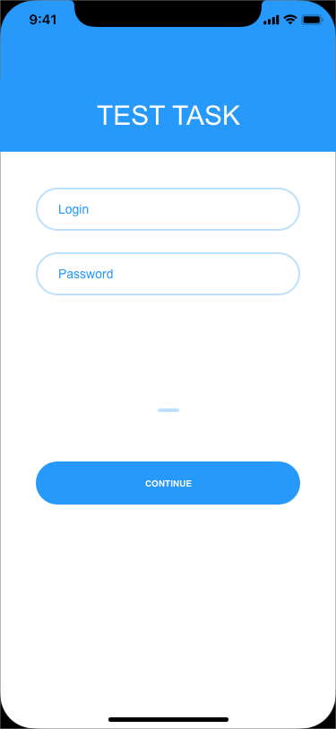
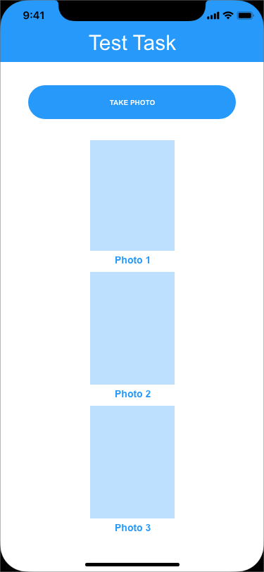
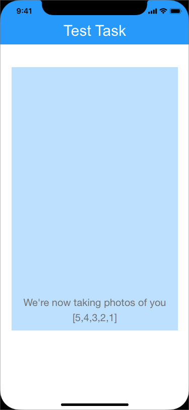

# Mobile Applicagtion Test Task

Create a simple Android that showcases its architecture and satisfies the given requirements

## Objectives

- Implement a simple login screen that accepts predefined credentials. Use an HTTP service online such as [Mocky](https://www.mocky.io/)
   or [httpstat](https://httpstat.us) to simulate a success (200) or an unauthorized access (401/403)

- Upon successful login, the user should see a main layout.

- Underneath this screen should be a simple logout button.

## Requirements

**User Interface**: up to you

**Android Framework**: `Kotlin`/`AndroidX`

**Unit tests**: nice to have

## Example of UI

Login:

Home:

Selfie:

